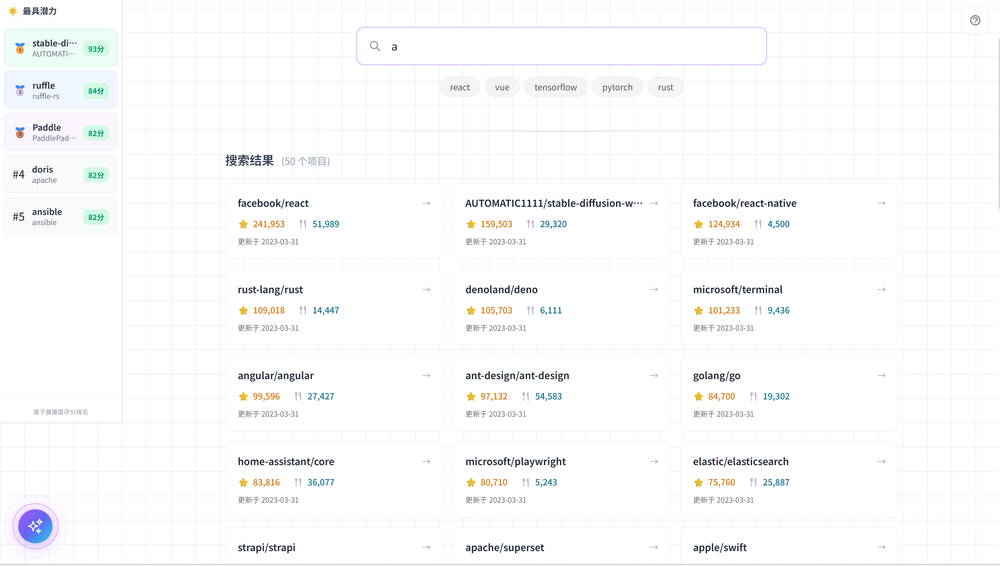
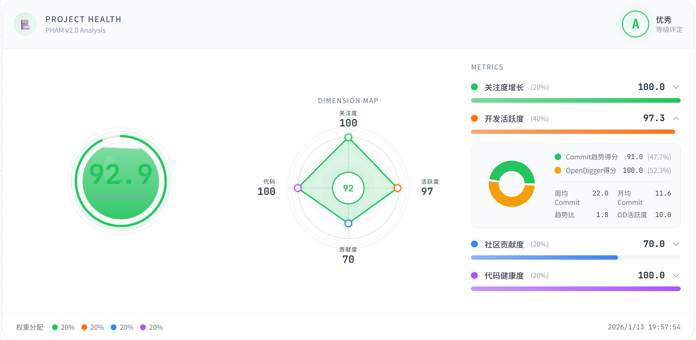
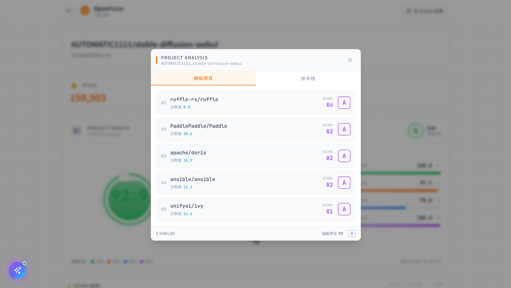
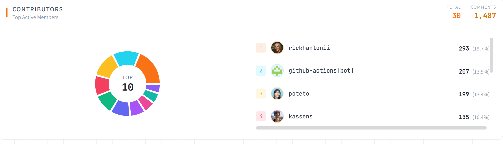

# OpenPulse

[](https://nodejs.org/)[](https://www.python.org/)[](https://www.mysql.com/)[](README-CN.md)

> **Open Source Community Health Assessment & Visualization Platform** — Insight into community pulse, quantify health metrics

## Table of Contents
- [Background](#background)
- [Introduction](#introduction)
- [Core Features](#core-features)
- [Technical Architecture](#technical-architecture)
- [Installation & Deployment](#installation--deployment)
- [User Guide](#user-guide)
- [Health Assessment Algorithm](#health-assessment-algorithm)
- [Roadmap](#roadmap)
- [Contributing](#contributing)
- [License](#license)

## Background
In the rapidly evolving open source ecosystem, understanding project health and vitality has become increasingly important for developers, maintainers, and organizations. OpenPulse was created to address this need, providing a comprehensive open source community health assessment and visualization platform. By combining multi-dimensional metrics with intelligent analysis, OpenPulse offers deep insights into project sustainability and growth potential.

## Introduction
**OpenPulse** is a comprehensive open source community health assessment platform that deeply explores the pulse and vitality of communities through multi-dimensional visualization and intelligent analysis. The system integrates OpenDigger data and leverages AI-driven multi-agent collaboration for real-time analysis.

**Core Capabilities:**
- **Community Panorama** — Multi-dimensional health metrics, 3D visualization of collaboration relationships
- **Lifecycle Analysis** — Historical retrospective + trend prediction, combined with OpenDigger data
- **Intelligent Collaboration** — MaxKB agent-assisted data analysis
- **Smart Search** — Trending rankings, intelligent sorting, contributor profiling

## Core Features

1. **Multi-dimensional Health Assessment**
   - Project health score (0-100)
   - Growth metrics (Star/Fork trends)
   - Activity monitoring (Commit/PR analysis)
   - Code churn evaluation

2. **Interactive Visualization**
   - Collaboration network display
   - Historical trend charts and analysis

3. **Intelligent Analysis**
   - MaxKB agent collaboration
  

4. **Search & Discovery**
   - Daily trending project rankings
   - Smart sorting by activity and relevance
   - Contributor profiling and matching

## Technical Architecture

### Frontend Stack
| Technology | Purpose |
|------------|---------|
| React | Web Framework |
| D3.js / Three.js | Visualization Engine (3D Sphere Graph) |
| Tailwind CSS | Styling Framework |
| Vite | Build Tool |

### Backend Stack
| Technology | Purpose |
|------------|---------|
| Python + FastAPI | Web Service Framework |
| Pandas / NumPy | Data Analysis |
| MySQL | Data Storage |
| OpenDigger API | Open Source Metrics Data |

### AI & Agents
| Technology | Purpose |
|------------|---------|
| MaxKB | Agent Collaboration |

## Installation & Deployment

### Requirements
- Python 3.8+
- Node.js 18+
- MySQL 8.0+
- Git

### 1. Clone Repository
```bash
git clone https://github.com/YourUsername/OpenPulse.git
cd OpenPulse
```

### 2. Backend Deployment
```bash
# Navigate to backend directory
cd backend

# Install Python dependencies
pip install -r requirements.txt

# Configure environment variables
# Create a .env file and add the following configuration:
```

| Variable | Description | Required |
|----------|-------------|:--------:|
| `GITHUB_TOKEN` | GitHub API access token | Yes |
| `MYSQL_HOST` | MySQL database address | Yes |
| `MYSQL_USER` | Database username | Yes |
| `MYSQL_PASSWORD` | Database password | Yes |
| `MYSQL_DATABASE` | Database name (default `openrank`) | No |
| `OPENDIGGER_API` | OpenDigger data API endpoint | No |

See `.env.example` for complete configuration options

```bash
# Start backend service
python main.py
```

### 3. Frontend Deployment
```bash
# Return to project root and navigate to frontend directory
cd ../frontend

# Install dependencies
npm install

# Start development server
npm run dev
```

### 4. Access the System
Open `http://127.0.0.1:5173` in your browser to access the platform.

## User Guide

### Homepage & Search
- **Browse Trending** — View daily updated trending projects
- **Search Projects** — Enter project name, sorted by relevance and activity


### Project Dashboard
- **Overview** — View closeness line charts, activity histograms
- **Health Analysis** — Check the project's health score calculated using the PHAM model


### Relationship Network Interaction
- **View Similar Health Projects** — Browse projects with similar health scores in the list

- **Contribution Details** — View project contributors

- **Intelligent Q&A** — Use the agent to get project analysis

## Health Assessment Algorithm

### PHAM - Project Health Assessment Model
Core algorithm that quantitatively evaluates open source project health, outputting a score from **0 to 100**.

### Overall Formula
```
M = 0.2 × Growth + 0.4 × Activity + 0.2 × Contribution + 0.2 × Code
```

### Four-Dimensional Assessment System

| Dimension | Weight | Key Metrics | Description |
|-----------|:------:|-------------|-------------|
| **Growth** | 20% | Star / Fork growth rate | Community attention |
| **Activity** | 40% | Commit trends + OpenDigger | Development activity (core) |
| **Contribution** | 20% | PR trends | Community contribution intensity |
| **Code Churn** | 20% | Code changes (logarithmic) | Development throughput |

### Detailed Calculation Logic

#### ⭐ Growth (Attention Growth) — 20%
```
Star growth rate:  x = (Current month Stars / (Previous 3 months avg Stars + 1)) × 100
Fork growth rate:  y = (Current month Forks / (Previous 3 months avg Forks + 1)) × 100

Score_Growth = 0.5 × min(x, 200)/2 + 0.5 × min(y, 200)/2

⚠️ Growth rate capped at 200% (score 100) to prevent score explosion from small base numbers
```

#### 🔥 Activity — 40%
```
Commit Trend:
Ratio_z = (Last week avg Commits + 1) / (Monthly avg Commits + 1)
Score_z = clamp(0, 100, 50 + (Ratio_z − 1) × 50)

OpenDigger Activity:
Score_m = min(100, OpenDigger_Activity × 10)

Final Score:
Score_Activity = 0.3 × Score_z + 0.7 × Score_m
```

| Ratio Value | Meaning | Score Trend |
|:-----------:|---------|:-----------:|
| `> 1` | Activity rising ↑ | `> 50` |
| `= 1` | Stable → | `= 50` |
| `< 1` | Activity declining ↓ | `< 50` |

#### 🤝 Contribution — 20%
```
Ratio_n = (Last week avg PRs + 1) / (Monthly avg PRs + 1)
Score_Contrib = clamp(0, 100, 50 + (Ratio_n − 1) × 50)
```

#### 💻 Code Churn (Code Health) — 20%
```
Total churn:  q = Lines added + Lines deleted
Score_Code = min(100, 20 × log₁₀(q + 1))
```

| Churn q | log₁₀(q+1) | Score |
|:-------:|:----------:|:-----:|
| 100 lines | ≈ 2 | 40 |
| 1,000 lines | ≈ 3 | 60 |
| 10,000 lines | ≈ 4 | 80 |
| 100,000 lines | ≈ 5 | 100 |

### Algorithm Implementation

```python
import math

def calculate_health_score(data):
    """
    Calculate project health score
    
    Args:
        data: dict, containing the following fields:
            - star_current_month      Stars added this month
            - star_avg_prev_3m        Average Stars over previous 3 months
            - fork_current_month      Forks added this month
            - fork_avg_prev_3m        Average Forks over previous 3 months
            - commit_avg_last_week    Average Commits last week
            - commit_avg_month        Average Commits this month
            - opendigger_activity     OpenDigger Activity metric
            - pr_avg_last_week        Average PRs last week
            - pr_avg_month            Average PRs this month
            - pull_additions          Lines of code added
            - pull_deletions          Lines of code deleted
    
    Returns:
        float: Health score (0-100)
    """
    
    # 1. Growth (Star & Fork) - 20%
    s_score = min((data['star_current_month'] / (data['star_avg_prev_3m'] + 1)) * 100, 200) / 2
    f_score = min((data['fork_current_month'] / (data['fork_avg_prev_3m'] + 1)) * 100, 200) / 2
    score_growth = 0.5 * s_score + 0.5 * f_score

    # 2. Activity (Commit & OpenDigger) - 40%
    c_ratio = (data['commit_avg_last_week'] + 1) / (data['commit_avg_month'] + 1)
    score_z = max(0, min(100, 50 + (c_ratio - 1) * 50))
    score_m = min(100, data['opendigger_activity'] * 10)
    score_activity = 0.3 * score_z + 0.7 * score_m

    # 3. Contribution (PR Trend) - 20%
    p_ratio = (data['pr_avg_last_week'] + 1) / (data['pr_avg_month'] + 1)
    score_contrib = max(0, min(100, 50 + (p_ratio - 1) * 50))

    # 4. Code Churn - 20%
    total_churn = data['pull_additions'] + data['pull_deletions']
    score_code = min(100, 20 * math.log10(total_churn + 1))

    # Final Aggregation
    final_score = (
        0.2 * score_growth +
        0.4 * score_activity +
        0.2 * score_contrib +
        0.2 * score_code
    )

    return round(final_score, 2)
```

## Backend Error Handling
When backend data fails to transmit to the frontend, a notification will pop up in the frontend. Developers can use this notification to improve the backend.


## Roadmap
- [x] Basic framework setup
- [x] Health assessment algorithm implementation
- [x] Visualization engine development
- [x] OpenDigger data integration
- [×] Improve multi-agent collaboration workflow
- [ ] Optimize 3D rendering performance
- [ ] Integrate more open source data sources
- [ ] Release mobile-responsive version
- [ ] Support custom weight configuration

## Contributing
We welcome Issues and Pull Requests to help improve the project. Before submitting, please ensure:
1. Issue descriptions are clear and complete
2. Pull Requests include detailed explanations
3. Code follows project conventions
4. Necessary test cases are provided

## License
This project is licensed under the [MIT License](LICENSE).

---

<p align="center">
<strong>OpenPulse</strong> — Insight into the pulse and vitality of open source communities
</p>
